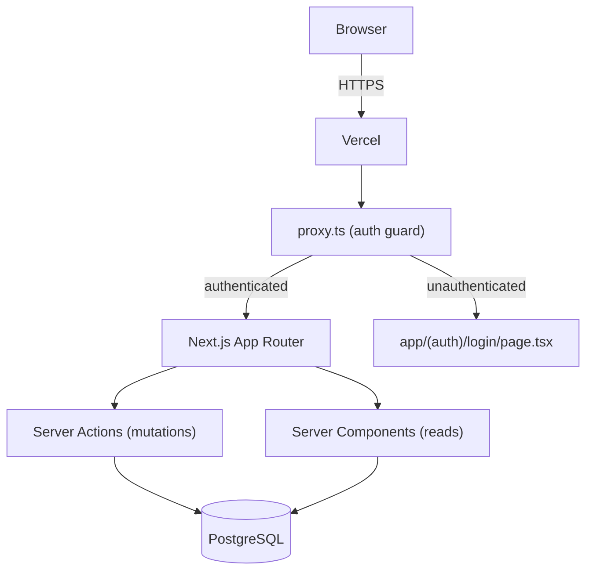

# Design Document: Poultry Farm Tracker

## Overview

A fullstack Next.js 16 web application deployed on Vercel that allows a single farmer to track feed purchases, monitor feed consumption, record daily egg production, and calculate profitability. The system correlates feed batch costs against egg yield revenue to give the farmer a clear picture of business performance.

The application uses the App Router with Server Actions for mutations, stateless JWT sessions stored in HttpOnly cookies for authentication, and a PostgreSQL database for persistence.

**Key design decisions:**
- Single-tenant: one farmer per deployment. No multi-user complexity.
- Server Actions for all mutations (no separate REST API layer needed for UI interactions).
- Route Handlers (`app/api/.../route.ts`) only where needed for non-form data fetching.
- Stateless JWT sessions using `jose` — no session table required.
- `proxy.ts` (Next.js 16 replacement for `middleware.ts`) for auth-gating all protected routes.
- Zod for server-side validation in all Server Actions.

---

## Architecture



**Request flow:**
1. Every request passes through `proxy.ts`, which verifies the session JWT cookie.
2. Unauthenticated requests to protected routes are redirected to `/login?redirect=<original-url>`.
3. Pages are Server Components that fetch data directly from the database.
4. Forms invoke Server Actions (`'use server'`) for all create/update operations.
5. All Server Actions re-verify the session (defense in depth — proxy alone is not sufficient).

---

## Components and Interfaces

### Route Structure

```
app/
  (auth)/
    login/
      page.tsx          # Login form
  (app)/
    layout.tsx          # Authenticated shell layout with nav
    page.tsx            # Dashboard (redirect to /dashboard)
    dashboard/
      page.tsx          # Dashboard overview
    feed/
      page.tsx          # Feed batch list
      new/
        page.tsx        # Log new feed batch
      [id]/
        page.tsx        # Feed batch detail + egg correlation
    eggs/
      page.tsx          # Egg records list
      new/
        page.tsx        # Log egg count
    reports/
      page.tsx          # Historical reporting with date range filter
    settings/
      page.tsx          # Egg price configuration
  api/
    (none required — all data access via Server Components + Server Actions)
lib/
  db.ts                 # PostgreSQL client (postgres.js or pg)
  session.ts            # JWT encrypt/decrypt, createSession, deleteSession
  auth.ts               # getSession() helper used in Server Actions
actions/
  auth.ts               # login, logout Server Actions
  feed.ts               # createFeedBatch, markFeedDepleted Server Actions
  eggs.ts               # upsertEggRecord Server Action
  settings.ts           # updateEggPrice Server Action
proxy.ts                # Auth guard (replaces middleware.ts in Next.js 16)
```

### Server Actions Interface

```typescript
// actions/auth.ts
export async function login(state: FormState, formData: FormData): Promise<FormState>
export async function logout(): Promise<never>  // redirects

// actions/feed.ts
export async function createFeedBatch(state: FormState, formData: FormData): Promise<FormState>
export async function markFeedDepleted(state: FormState, formData: FormData): Promise<FormState>

// actions/eggs.ts
export async function upsertEggRecord(state: FormState, formData: FormData): Promise<FormState>

// actions/settings.ts
export async function updateEggPrice(state: FormState, formData: FormData): Promise<FormState>
```

### Session Interface

```typescript
// lib/session.ts
interface SessionPayload {
  userId: string
  expiresAt: Date
}

export async function encrypt(payload: SessionPayload): Promise<string>
export async function decrypt(token: string): Promise<SessionPayload | null>
export async function createSession(userId: string): Promise<void>
export async function deleteSession(): Promise<void>
export async function getSession(): Promise<SessionPayload | null>
```

### Proxy (Auth Guard)

```typescript
// proxy.ts
export function proxy(request: NextRequest): NextResponse

export const config = {
  matcher: ['/((?!login|_next/static|_next/image|favicon.ico).*)'],
}
```

---

## Data Models

### PostgreSQL Schema

```sql
-- Users (farmers)
CREATE TABLE users (
  id          UUID PRIMARY KEY DEFAULT gen_random_uuid(),
  email       TEXT NOT NULL UNIQUE,
  password_hash TEXT NOT NULL,
  created_at  TIMESTAMPTZ NOT NULL DEFAULT now()
);

-- Feed batches
CREATE TABLE feed_batches (
  id              UUID PRIMARY KEY DEFAULT gen_random_uuid(),
  user_id         UUID NOT NULL REFERENCES users(id) ON DELETE CASCADE,
  feed_type       TEXT NOT NULL,
  quantity_kg     NUMERIC(10, 2) NOT NULL CHECK (quantity_kg > 0),
  total_cost      NUMERIC(10, 2) NOT NULL CHECK (total_cost >= 0),
  cost_per_kg     NUMERIC(10, 4) NOT NULL GENERATED ALWAYS AS (total_cost / quantity_kg) STORED,
  supplier_name   TEXT,
  purchase_date   DATE NOT NULL,
  status          TEXT NOT NULL DEFAULT 'active' CHECK (status IN ('active', 'depleted')),
  created_at      TIMESTAMPTZ NOT NULL DEFAULT now()
);
CREATE INDEX idx_feed_batches_user_purchase ON feed_batches(user_id, purchase_date);

-- Depletion events
CREATE TABLE depletion_events (
  id              UUID PRIMARY KEY DEFAULT gen_random_uuid(),
  feed_batch_id   UUID NOT NULL REFERENCES feed_batches(id) ON DELETE CASCADE,
  depletion_date  DATE NOT NULL,
  created_at      TIMESTAMPTZ NOT NULL DEFAULT now()
);

-- Egg records (one per day per user)
CREATE TABLE egg_records (
  id              UUID PRIMARY KEY DEFAULT gen_random_uuid(),
  user_id         UUID NOT NULL REFERENCES users(id) ON DELETE CASCADE,
  collection_date DATE NOT NULL,
  egg_count       INTEGER NOT NULL CHECK (egg_count >= 0),
  feed_batch_id   UUID REFERENCES feed_batches(id) ON DELETE SET NULL,
  created_at      TIMESTAMPTZ NOT NULL DEFAULT now(),
  UNIQUE (user_id, collection_date)
);
CREATE INDEX idx_egg_records_user_date ON egg_records(user_id, collection_date);

-- Egg price history
CREATE TABLE egg_prices (
  id          UUID PRIMARY KEY DEFAULT gen_random_uuid(),
  user_id     UUID NOT NULL REFERENCES users(id) ON DELETE CASCADE,
  price       NUMERIC(10, 4) NOT NULL CHECK (price > 0),
  effective_at TIMESTAMPTZ NOT NULL DEFAULT now()
);
```

### TypeScript Types

```typescript
type FeedBatchStatus = 'active' | 'depleted'

interface FeedBatch {
  id: string
  userId: string
  feedType: string
  quantityKg: number
  totalCost: number
  costPerKg: number
  supplierName: string | null
  purchaseDate: string        // ISO date
  status: FeedBatchStatus
  createdAt: string
}

interface EggRecord {
  id: string
  userId: string
  collectionDate: string      // ISO date
  eggCount: number
  feedBatchId: string | null
  createdAt: string
}

interface EggPrice {
  id: string
  userId: string
  price: number
  effectiveAt: string
}

interface DepletionEvent {
  id: string
  feedBatchId: string
  depletionDate: string
  createdAt: string
}

// Computed view for feed batch detail
interface FeedBatchWithCorrelation extends FeedBatch {
  totalEggs: number
  eggYieldRate: number        // eggs per kg
  revenue: number | null      // null if no egg price configured
  profit: number | null
  profitabilityStatus: 'profitable' | 'break-even' | 'loss' | null
  depletionDate: string | null
}
```

### Profitability Computation

All profitability calculations are performed in application code (not SQL) to keep logic testable:

```
revenue = totalEggs × currentEggPrice
profit  = revenue − feedBatch.totalCost
status  = profit > 0 → "profitable"
          profit = 0 → "break-even"
          profit < 0 → "loss"
```

For the overall report over a date range:
```
totalFeedCost = SUM(feed_batches.total_cost WHERE purchase_date IN range)
totalEggs     = SUM(egg_records.egg_count WHERE collection_date IN range)
totalRevenue  = totalEggs × currentEggPrice
netProfit     = totalRevenue − totalFeedCost
```

---

## Correctness Properties

*A property is a characteristic or behavior that should hold true across all valid executions of a system — essentially, a formal statement about what the system should do. Properties serve as the bridge between human-readable specifications and machine-verifiable correctness guarantees.*

### Property 1: Feed batch required-field validation rejects incomplete submissions

*For any* feed batch submission missing one or more of the required fields (feed type, quantity, cost, purchase date), the `createFeedBatch` Server Action shall return a validation error and no new `feed_batches` row shall be created.

**Validates: Requirements 1.3**

---

### Property 2: Cost-per-kg is always consistent with total cost and quantity

*For any* feed batch stored in the database, `cost_per_kg × quantity_kg` shall equal `total_cost` (within floating-point rounding tolerance).

**Validates: Requirements 1.4**

---

### Property 3: New feed batches are always created with status "active"

*For any* successfully created feed batch, its initial status shall be "active".

**Validates: Requirements 1.5**

---

### Property 4: Active feed batches are ordered oldest-first

*For any* set of active feed batches belonging to a user, the list returned by the dashboard query shall be ordered by `purchase_date` ascending.

**Validates: Requirements 2.2**

---

### Property 5: Depletion transitions status from active to depleted

*For any* active feed batch, after a depletion event is recorded, the batch status shall be "depleted" and a corresponding `depletion_events` row shall exist.

**Validates: Requirements 3.1, 3.2**

---

### Property 6: Depleting an already-depleted batch is rejected

*For any* feed batch with status "depleted", attempting to mark it as finished again shall return an error and the batch status shall remain "depleted".

**Validates: Requirements 3.3**

---

### Property 7: Egg record upsert — duplicate date updates rather than inserts

*For any* user and collection date, submitting two egg counts for the same date shall result in exactly one `egg_records` row for that (user, date) pair, with the egg count equal to the second submission.

**Validates: Requirements 4.2**

---

### Property 8: Negative egg counts are rejected

*For any* egg count submission where the count is less than zero, the `upsertEggRecord` action shall return a validation error and no record shall be created or modified.

**Validates: Requirements 4.3**

---

### Property 9: Egg-to-feed-batch correlation totals are consistent

*For any* feed batch with a known purchase date and depletion date, the total eggs computed for that batch shall equal the sum of all `egg_records.egg_count` values where `collection_date` falls within `[purchase_date, depletion_date]`.

**Validates: Requirements 5.1**

---

### Property 10: Profitability classification is consistent with profit value

*For any* feed batch with a computed profit value, the profitability status shall satisfy: `profit > 0 → "profitable"`, `profit = 0 → "break-even"`, `profit < 0 → "loss"`.

**Validates: Requirements 6.3, 6.4, 6.5**

---

### Property 11: Non-positive egg price is rejected

*For any* egg price submission where the value is zero or negative, the `updateEggPrice` action shall return a validation error and the stored egg price shall be unchanged.

**Validates: Requirements 7.4**

---

### Property 12: Egg price history is append-only

*For any* sequence of egg price updates, all previous price values with their timestamps shall remain in the `egg_prices` table after each update.

**Validates: Requirements 7.3**

---

### Property 13: Authentication — unauthenticated requests are redirected

*For any* request to a protected route without a valid session cookie, the proxy shall redirect to `/login` with the original URL preserved as a query parameter.

**Validates: Requirements 10.1, 10.5**

---

### Property 14: Data isolation — farmers only access their own data

*For any* database query executed within a Server Action or Server Component, the query shall include a `WHERE user_id = <session.userId>` predicate, ensuring no cross-user data leakage.

**Validates: Requirements 10.6**

---

### Property 15: Failed database writes do not partially commit

*For any* operation that writes to multiple tables (e.g., marking a batch depleted writes to both `depletion_events` and updates `feed_batches`), either all writes succeed or none are committed.

**Validates: Requirements 11.2**

---

## Error Handling

### Validation Errors
- All Server Actions use Zod schemas to validate inputs before touching the database.
- Validation failures return a `FormState` object with field-level error messages.
- The UI renders errors inline next to the relevant field using `useActionState`.

### Authentication Errors
- `proxy.ts` redirects unauthenticated requests to `/login?redirect=<url>`.
- Server Actions call `getSession()` and throw/redirect if no valid session exists (defense in depth).
- Login failures return a generic "Invalid email or password" message — no field-level specificity (Requirement 10.3).

### Database Errors
- Operations that touch multiple tables are wrapped in a PostgreSQL transaction.
- If a transaction fails, the error is caught, logged server-side, and a generic error message is returned to the client.
- The client never receives raw database error messages.

### Not-Found / Empty States
- Dashboard with no data shows zero values (not errors) per Requirement 8.4.
- Reports with no data in range show an explicit "No records found" message per Requirement 9.3.
- No active feed batches shows a prompt to add feed per Requirement 2.4.

---

## Testing Strategy

### Dual Testing Approach

Both unit tests and property-based tests are required. They are complementary:
- Unit tests cover specific examples, integration points, and edge cases.
- Property-based tests verify universal correctness across randomized inputs.

### Unit Tests

Focus areas:
- Profitability calculation functions (`computeProfit`, `classifyProfitability`) with specific numeric examples including boundary values (profit = 0).
- Egg-to-batch correlation query with known date ranges.
- Session encrypt/decrypt round trip with a fixed payload.
- Zod schema validation — specific valid and invalid inputs for each action.
- Dashboard aggregation with known monthly data.

### Property-Based Tests

**Library:** `fast-check` (TypeScript-native, well-maintained, works in Node.js test runner).

**Configuration:** Minimum 100 runs per property (`numRuns: 100` in `fc.assert`).

Each property test is tagged with a comment in the format:
`// Feature: poultry-farm-tracker, Property <N>: <property_text>`

**Properties to implement as automated tests:**

| Property | Test description |
|---|---|
| P2 | For any `(totalCost, quantityKg)` pair with `quantityKg > 0`, `costPerKg × quantityKg ≈ totalCost` |
| P7 | For any user + date + two egg counts, upsert twice → exactly one row with second count |
| P8 | For any negative integer, `upsertEggRecord` returns a validation error |
| P9 | For any feed batch date range and set of egg records, correlation total equals filtered sum |
| P10 | For any numeric profit value, `classifyProfitability(profit)` returns the correct status |
| P11 | For any non-positive number, `updateEggPrice` returns a validation error |
| P12 | For any sequence of price updates, all previous prices remain in the history |
| P15 | For any simulated DB failure mid-transaction, no partial writes are committed |

**Example property test (P10):**

```typescript
// Feature: poultry-farm-tracker, Property 10: profitability classification is consistent with profit value
import * as fc from 'fast-check'
import { classifyProfitability } from '@/lib/profitability'

test('profitability classification matches profit sign', () => {
  fc.assert(
    fc.property(fc.float({ noNaN: true }), (profit) => {
      const status = classifyProfitability(profit)
      if (profit > 0) return status === 'profitable'
      if (profit === 0) return status === 'break-even'
      return status === 'loss'
    }),
    { numRuns: 100 }
  )
})
```

### Test Runner

Use Node.js built-in test runner (`node:test`) or Vitest (both work with `fast-check`). Run with `--run` flag for single-pass CI execution.
